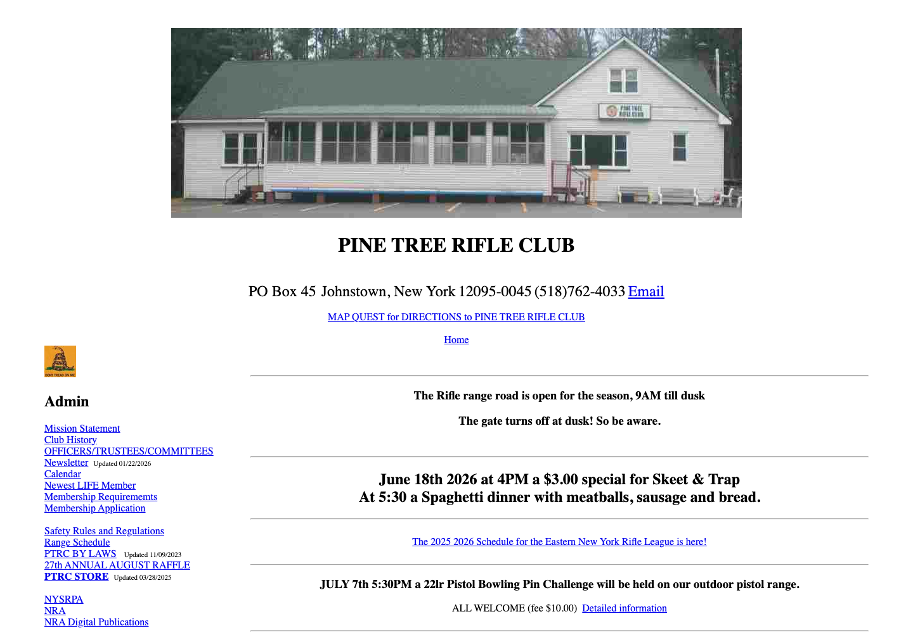

# Pine Tree Rifle Club

Restoration of the club's lost website: **125 pages**, local photographs and documents, original URLs, and the original appearance. Built with **Astro and EmDash**, ready for Cloudflare Workers. Tailwind and a design system are the next phase.



## Start developing

Use Node.js **22.16 or newer** and npm.

```sh
npm ci
npx emdash secrets generate --write .env
npm run dev
```

Open the local address printed by Astro, usually `http://localhost:4321`. Visit `/_emdash/admin/` to complete setup. **Include the seed content** to import all restored pages. Register your own administrator passkey. Local development uses simulated D1 and R2; it does not need a Cloudflare account.

The encryption key belongs in the ignored `.env` file. Keep a private backup; never commit it or a production database.

## Where things live

| Location | Purpose |
| --- | --- |
| `src/layouts/Base.astro` | Shared page layout, navigation, metadata and landmarks |
| `src/components/` | Reusable recovered homepage header |
| `src/pages/[...path].astro` | Original page URLs, rendered from EmDash |
| `src/assets/` | Images, documents and compatibility styles grouped by type |
| `src/data/assetMap.json` | Maps grouped source assets to original public URLs |
| `src/content/recovered.json` | Restored content for the offline export |
| `seed/seed.json` | EmDash collection model and initial content |
| `recovery/` | Original bytes, capture history, templates and recovery evidence; not served |
| `scripts/` | Recovery, migration, asset preparation and verification tools |

Edit published content through EmDash. The initial `body` field contains HTML to preserve the recovered tables and typography; migration to structured components is a later step. The shared layout stays in Astro. Seed files initialize a new database and do not overwrite existing content on subsequent deployments.

Add assets under `src/assets/` and register their public paths in `src/data/assetMap.json`. `public/` is generated, ignored, and rebuilt automatically. Original paths are preserved so archived links remain useful.

## Offline restoration and checks

```sh
npm run build:offline
npm run check
npm run validate
npm run audit
```

`_site/` contains the complete static restoration with local assets. Serve that directory with any static HTTP server. External hyperlinks, such as payment and Google services, still require internet access.

The offline build uses the repository's restored content snapshot, **not later CMS edits**. Keep exports/backups of the CMS database and uploads when editing production content. HTML validation and the browser audit should also be run against published changes.

`check` verifies content coverage, internal links, fragments, metadata and local assets. `validate` checks HTML5 using html-validate. `audit` checks every exported page with Playwright and axe, records browser resource failures and refreshes `docs/homepage.png` and `docs/audit.json`. It uses installed Chrome on macOS; on other platforms install Chromium with `npx playwright install chromium`.

## Publish to Cloudflare

Follow the [EmDash Cloudflare deployment guide](https://docs.emdashcms.com/deployment/cloudflare/).

```sh
npx wrangler login
npm run deploy
npx wrangler secret put EMDASH_ENCRYPTION_KEY
```

At the secret prompt, enter your private encryption key from `.env`. The Worker is `pine-tree-rifle-club`; its named D1 database and R2 bucket are declared in `wrangler.jsonc` and provisioned on deployment. There are no account credentials in the repository.

Set `SITE_URL` in your build environment to the final public origin, including its trailing slash, so canonicals and the sitemap use the correct domain. Set `EMDASH_SITE_URL` for the runtime origin before registering your production passkey. Complete setup at your intended production domain and **include the recovered seed content**. Passkeys are tied to the setup domain.

The deployment includes a Cron handler for scheduled publishing and maintenance. Sandboxed plugins are not enabled; add the documented loader binding and sandbox adapter when needed.

After deployment, check the homepage, site directory, representative nested pages and PDFs, then run the browser audit against your origin:

```sh
AUDIT_URL=https://your-public-origin.example/ npm run audit
```

GitHub stores the source; hosting uses Cloudflare Workers. GitHub Pages could serve `_site/`, but cannot run the EmDash CMS.

## Recovery and limitations

See [recovery notes](docs/recovery.md). Some originally linked files were not available from any recovered source. They are listed on `missing-content.html`, and missing images are explicitly marked. No replacement photographs or missing content were invented.

The original fixed-width layouts are retained for restoration fidelity. Automated accessibility checks do not replace keyboard, screen-reader and document review. Older schedules and reports are historical; the club should confirm current announcements and contacts before launch.
